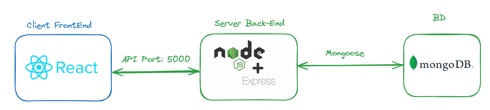
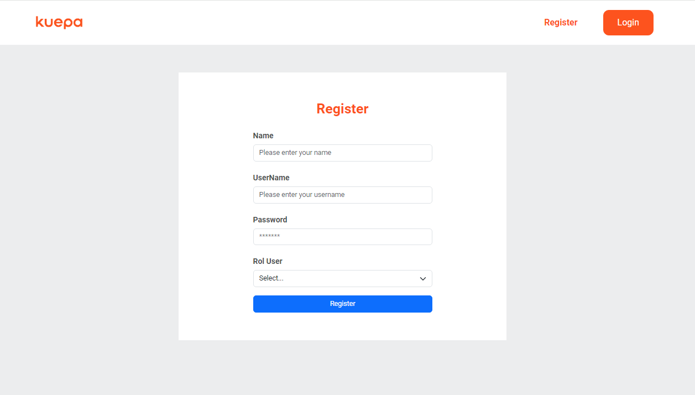
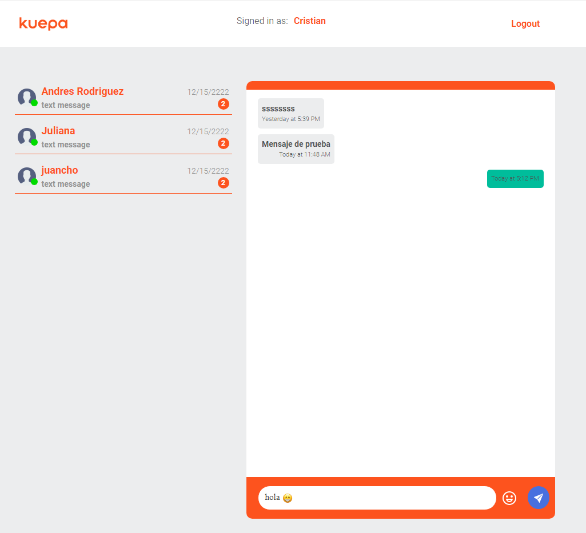

# Kuepa - chat 👋

## Objetivo

Crear una herramienta de chat a las clases virtuales, permitiendo la interaccion entre estudiante y moderador

- Registro de nuevos usuarios (Nombre, UserName, Password, Rol {Moderador,Estudiante} )
- Login (inicio de sesión de usuarios registrados)
- Chat (interaccion entre usuarios en el chat)

## Estructura del proyecto

## BD

- MongoDB

## Servidor

## Node Js bajo Express Js

1. Ingresar a la carpeta server e instalar las dependencias

- cd server
- pnpm i
- Mongoose validator bcrypt jwt express
- nodemon para iniciar el servido
- Port 5000

## Cliente

## React Js

1. Ingresar a la carpeta client e instalar las dependencias

- cd client
- pnpm i
- pnpm run dev
- Port 5173

